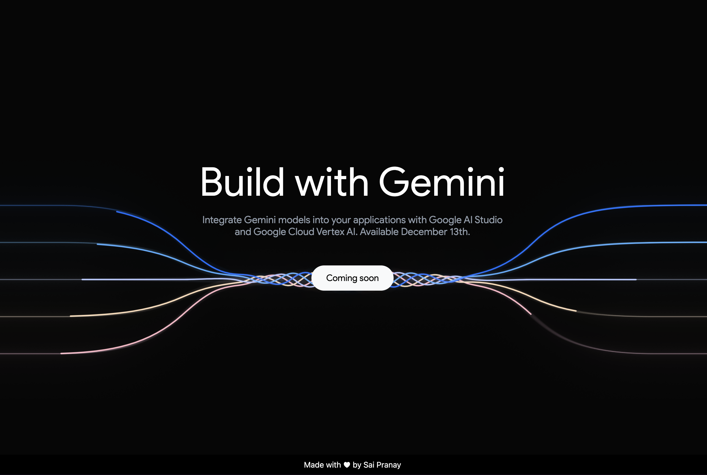

## README.md

**Google Gemini Thread Animation**

This project demonstrates a reverse-engineered version of the Google Gemini thread animation, built with React.js, Tailwind CSS, and lottiefiles.

### Technologies

* **React.js**: A JavaScript library for building user interfaces.
* **Tailwind CSS**: A utility-first CSS framework for rapid styling.
* **lottiefiles**: A platform for creating and sharing Lottie animations.
* **Scroll events**: Utilize scroll events to control animation speed and direction.

### Usage

1. Clone this repository.
2. Install dependencies: `npm install` or `yarn install`.
3. Run the development server: `npm start` or `yarn start`.
4. Open http://localhost:3000 in your browser.

### Demo

See the live demo at [https://gemini-thread-animation.vercel.app/](https://gemini-thread-animation.vercel.app/)

### Contributing

Feel free to contribute to this project by:

* Reporting bugs.
* Suggesting improvements.
* Creating pull requests with your changes.

### License

This project is licensed under the MIT License. See the `LICENSE` file for details.

### Credits

* Original animation: [https://deepmind.google/technologies/gemini/#build-with-gemini](https://deepmind.google/technologies/gemini/#build-with-gemini)